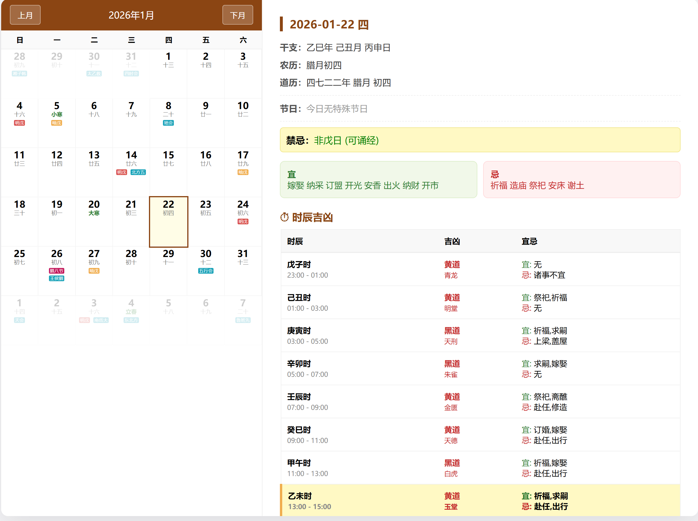

本中华道历系统完全开源，免费。无任何后门
已经更新2.6了，截图过期，最新版预览请点击
https://dao.jeffnas.dpdns.org/
来查看，不过在线版，没有在线测算工具。

国内用户下载：关注微信公众号  壹贰新知

最新版中文名已经更改为：道教日历

道教日历
· 道法自然 · 共修大道

市面上的日历app ，只要有道历的就还有佛历，然后还有很多名人诞辰。道教修行人那里用得上。
反正道长日常也就是查个戊日，更多的也就是看一下，给别人算卦的时候，看看下天干地支而已
本道历系统，包含日常的中国传统节日，与道历与道教需要关注的神仙诞辰与戊日的提示。也可以选择以前的日期查询
主要是我在这上面还把很多没用的常规节日去掉了，只保留了戊日。神仙圣诞。中国传统假日，如天干地支。

手机电脑自适应的预览图

如果您要转载使用，请标注好是微信壹贰新知公众号设计的。

项目在线预览地址：https://dao.jeffnas.dpdns.org/
微信打开的话，还能在菜单里调整字体大小，适合眼力不好的道友使用
然后想放到手机桌面的话：
大家可以先下载via浏览器，然后复制这个地址打开，然后在手机系统设置里-应用-权限里找到via浏览器，给他打开创建桌面快捷方式，后回到浏览器里点右下角三个点-工具箱，翻页第二项-添加到桌面  按提示添加即可到桌面上了。

虽然我现在开源发布了这套系统，希望大家用的好的话，
也多多来支持一下本道：
毕竟这最冷的季节，空调快开不起了，还快到过年了，
本道收入微薄，希望大家觉得好用多多赞赏支持。

捐赠支持：支付宝19203481801  微信38329470
